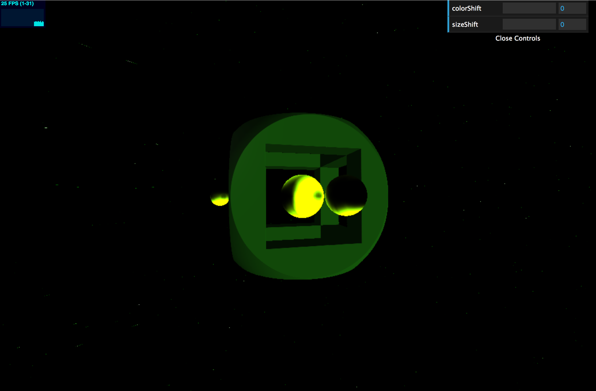
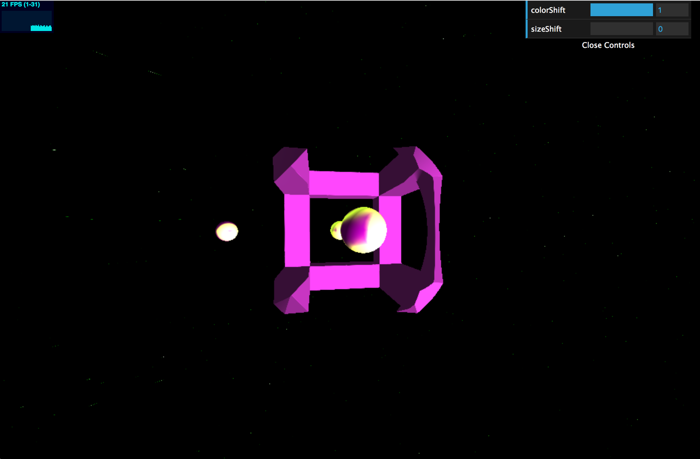

# CIS 566 HW2 Raymarching SDFs

Evelyn Bailey

ebail

Project: https://eviebail.github.io/hw02-raymarching-sdfs/

Website: https://evelyn.pb.studio

Features

This project is an exploration of using Signed Distance Functions (SDF) to create interesting visual effects. Below are the traits.

The squarcle in the middle is a combination of 2 types of SDFs that are combined using intersection and union functions. The main shape is achieved by intersecting a box SDF and a sphere SDF. The square holes are then computed by subtracting 3 rectangles that go through the center of the main shape. The shading for the object is Lambert shading with a Blinn Phong specular highlight.

The spheres are 3 separate SDFs that are smoothly blended, so that when the smaller spheres come near the center sphere, they appear to be "absorbed" into it, as shown below:

The spheres are shaded with a Lambert Shader, and the color was created by using the noise calculated by Fractal Brownian Motion (FBM) using the pixel's position. The shape of the 'cells' were modified by using a parabola function to smooth out the noise generated by FBM.

Similarly, the background was generated using FBM but with a smoothstep function to generate the effect of stars.

For the ui controls, the user can shift the color of the scene as well as modify the size of the center sphere. If the color is changed, the value is passed into the shader and is added to the red and blue channels, shifting the color from green to pink. If the size value is changed, the value is passed into shader and modifies the radius of the center sphere.

As for movement, the center squarcle slowly rotates about the Y axis over time. This is accomplished by applying the inverse of the rotation matrix about the Y axis. The spheres' translation is acheived by shifting the position of the ray using a sin function over time. 

The pixel to be rendered is computed by finding the intersection between the ray and each of the SDFs. To organize the space, I created a Bounding Volume Hierarchy to partition the space to make rendering more efficient. The outer bounding box surrounds all the SDFs in the scene. If the ray is within the bounds of the outer bounding box, the program also checks if it is within the bounding box computed for the sphere objects and the center structure. If it lands within either bounding box, it then checks the distance between the ray and the bounding box.

Helpful Resources:

Inigo Quilez's Website: http://www.iquilezles.org/www/articles/distfunctions/distfunctions.htm?fbclid=IwAR0PNmxEiuP8l6DiKXRZuof72suU8iMfbaqDvx4dps46gHCK8DKQgkEZXV8

Jamie Wong's Website: http://jamie-wong.com/2016/07/15/ray-marching-signed-distance-functions/?fbclid=IwAR3HqMz5S7APb_7L7cq_Z0qWf0ile3kX7oeTXv0fpjTgmy1vAmpAxfl-WuM

And the help of the TAs :)
